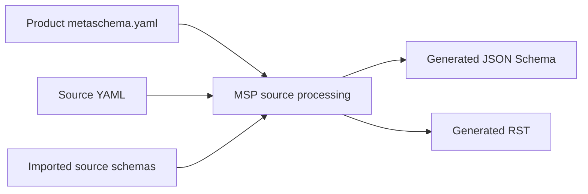
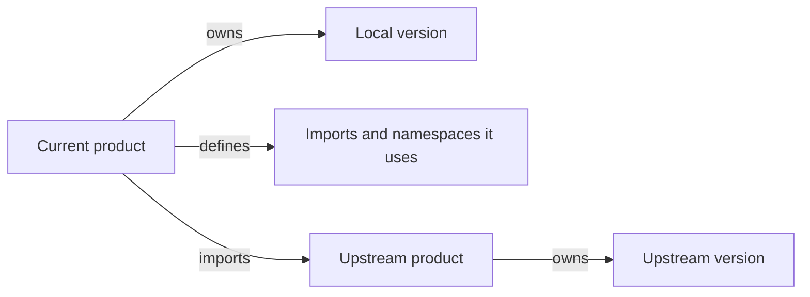

# Architecture

MSP separates hand-edited schema source from generated release artifacts. This
keeps schema authoring readable while ensuring published references contain
concrete, release-specific URLs.

## Processing Flow

1. A product stores one `metaschema.yaml` at `schema/<product>/`.
2. MSP loads source YAML files below that product directory. Nested directories,
   such as `schema/va-spec/base`, use the same product configuration.
3. The configuration provides the local product version plus any imports and
   namespaces required by that product's source YAML.
4. MSP resolves class relationships and `$refCurie` values, loading imported
   schemas only when it needs their definitions.
5. Product `make all` targets generate split JSON Schema files and RST files.

## Authoring and Output

Source YAML is the authoring format. It can use `$refCurie` values and namespace
templates such as `{version}` where configuration owns the version.

Generated JSON Schema and RST are publication artifacts. They must contain
concrete version values and `$ref` URLs. They must not contain `$refCurie` or
`{version}` placeholders.

If a generated artifact contains an unresolved CURIE, version template, or a
configured schema version that is stale, treat it as an MSP bug unless a test
fixture documents the exception.

## Product Boundaries

Each product owns only its own `metaschema.yaml` and version. A downstream
product reads an upstream product's version through its import path; it does
not duplicate upstream version values. Imports and namespaces are local to the
product that uses them. An upstream alias is not inherited automatically.

For release details and exact configuration rules, see [Metaschema
Configuration](metaschema-config.md) and [Release Preparation](release-prep.md).
