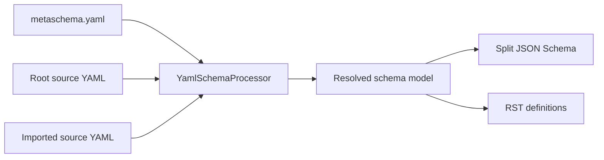

# Processor Internals

This guide is for contributors who need to understand MSP's processing model.
Schema-authoring and release rules are documented in [How It Works](../schema-authoring/index.md)
and [Release Preparation](../release-management/release-prep.md).

## Processing Model

`YamlSchemaProcessor` loads a root source YAML file and its owning
`metaschema.yaml`. It applies local configuration, loads imports when their
definitions are needed, and resolves inheritance and references into a
processed schema model.

## Configuration Boundaries

Each product owns one `metaschema.yaml` at `schema/<product>/`. That file owns
the local product version and the imports and namespaces used directly by the
product. Imported products own their own versions; MSP reads them through the
imported product configuration rather than duplicating them downstream.

Source YAML provides local model definitions. Generated artifacts contain the
complete inherited definitions and concrete references.

## Output Paths

The source-processing scripts use the processed model to produce output:

* `source2splitjs` writes one JSON Schema artifact per exported class.
* `y2t` writes RST definition artifacts.
* `source2classes` writes the class list used by product builds.

Generated output must use concrete `$ref` URLs and versions. It must not retain
`$refCurie` or `{version}` templates.

## Version Management

`source2updated` applies configured versions to source URL segments and checks
for hard-coded versioned references. `gks-release-prep` coordinates release
updates around that command, the immediate upstream submodule, and the product
build.
