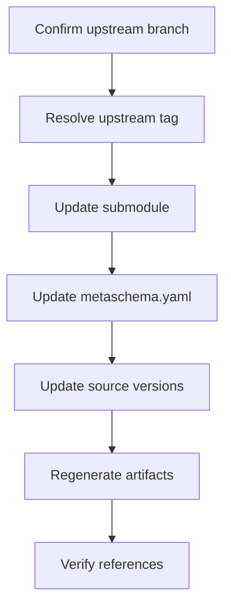

# Release Preparation

Releasing a GKS product changes more than its displayed version. The product
version must agree with source `$id` values and generated references. A
downstream product can also need to point at the released version of its
immediate upstream product.

`gks-release-prep` coordinates those changes from a requested product version.
Run it after deciding the release version and, for a downstream product, the
upstream branch or tag to use. Run it before reviewing and committing the
release changes.

Run this command from the root of the product repository being released. The
repository root must contain `schema/`. The product name is inferred from the
repository directory name; for example, a checkout directory named `va-spec`
uses `schema/va-spec/metaschema.yaml`.

## What It Changes

The command updates the immediate upstream submodule when needed, updates the
local product version, regenerates artifacts, and verifies source references.
It does not stage files, commit, tag, or push changes. Review the working tree
diff and create the release commit manually.

If a later step fails, release prep does not roll back earlier changes to
`.gitmodules`, the submodule checkout, source YAML, or generated artifacts.
Review and resolve the resulting working tree changes manually.

Release prep warns if the product repo or upstream submodule has uncommitted
changes. Use `--fail-on-dirty` when those warnings should fail the command.

## Downstream Products

For downstream products, the immediate upstream product is inferred from the
single submodule entry in `.gitmodules`. Release prep intentionally accepts only
one immediate upstream submodule. Transitive upstream products should be updated
in their own release branches first.

### Change the Upstream Branch

Provide `--upstream-branch` when the upstream branch should be changed or
explicitly rewritten:

```shell
gks-release-prep --version 1.1.0 --upstream-branch 1.2.0-ballot.2026-07
```

### Keep the Current Upstream Branch

If the existing `.gitmodules` branch is already correct, provide
`--use-current-upstream-branch` instead:

```shell
gks-release-prep --version 1.1.0 --use-current-upstream-branch
```

### Release Workflow

For a downstream product, release prep performs the following steps:



1. Initialize the submodule if needed, then fetch remote branches and tags.
2. Verify `origin/<branch>` and resolve the requested or latest reachable tag.
3. Update `.gitmodules`, update the submodule from the remote branch, and check
   out the resolved tag.
4. Update the local product version and source YAML version references.
5. Run `make clean`, then `make all` to regenerate artifacts.
6. Verify source YAML references with `source2updated --check`.

### Pin an Upstream Tag

To pin a specific upstream tag instead of using the latest reachable tag, pass
`--upstream-tag`:

```shell
gks-release-prep --version 1.1.0 --upstream-branch 1.2.0-ballot.2026-07 --upstream-tag v1.2.0-ballot.2026-07.1
```

`--upstream-tag` expects the exact Git tag name, including `v` when present.
The tag selects the Git checkout; `metaschema.yaml` versions never include `v`.

If the current `.gitmodules` branch is correct and only the tag should be
pinned, combine the tag with `--use-current-upstream-branch`.

### Keep the Existing Submodule Checkout

If the imported product is already at the correct checkout and should not be
updated, use `--skip-upstream`:

```shell
gks-release-prep --version 1.1.0 --skip-upstream
```

This leaves `.gitmodules` and the submodule checkout unchanged. The command
still updates the local product version, regenerates artifacts, and verifies
source YAML references.

## First Product

The first product in the release chain, such as `gks-core`, has no upstream
submodule. For those products, omit the upstream flags:

```shell
gks-release-prep --version 1.2.0
```

If `.gitmodules` is missing but a `submodules` directory exists, release prep
fails because the checkout looks like a downstream product with incomplete
submodule metadata.

## Validation

To validate the product config, `.gitmodules` entry, submodule directory,
branch, and resolved tag without changing files, add `--validate`:

```shell
gks-release-prep --validate --version 1.1.0 --upstream-branch 1.2.0-ballot.2026-07
```

The command prints the product, schema path, submodule branch/tag, and build
steps as it runs.

Validation checks the local git state only. It does not initialize submodules,
fetch tags, update remote branches, or change files.
