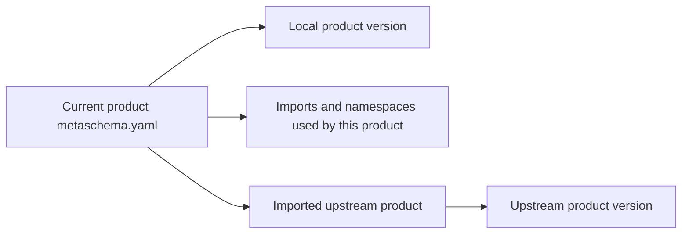

# Configuration

`metaschema.yaml` contains the configuration shared by every source YAML file
in a product. It has three top-level keys:

* `versions` identifies the local product version.
* `imports` maps an alias to the source YAML file that provides an upstream
  model.
* `namespaces` maps an alias to the generated JSON Schema Uniform Resource
  Locator (URL) it represents.

Version values are used in schema URLs. Use `1.1.0`, not a Git tag such as
`v1.1.0`.

For example, a VA-Spec product that uses VRS and Cat-VRS might have this
configuration:

```yaml
versions:
  va-spec: 1.1.0
imports:
  vrs: ../vrs/vrs-source.yaml
  cat-vrs: ../cat-vrs/catvrs-source.yaml
namespaces:
  vrs: /ga4gh/schema/vrs/{version}/json/
  cat-vrs: /ga4gh/schema/cat-vrs/{version}/json/
```

## Ownership



Each product owns one `metaschema.yaml`, its local version, and the aliases its
source YAML uses directly. An imported product owns its version. Do not repeat
upstream version values in the downstream product.

Source YAML files must not define `versions`, `imports`, or `namespaces`. MSP
warns and ignores those source-local sections, and `source2updated` removes them
during release updates.

## Imports and Namespaces

Use `imports` when MSP needs an upstream definition, such as for inherited
classes or imported definitions. Use `namespaces` when an alias must render to a
generated `$ref` URL. Many aliases need both, but a reference that only needs to
render an external URL can use `namespaces` alone.

Declare only the aliases used directly by the current product's source YAML.
Aliases used by an upstream product are not inherited automatically.

Namespaces can use `{version}`. MSP resolves it from the local product version
or the imported product's `metaschema.yaml`. A namespace with a concrete version
must already match that configured version.

Keep the product's `$id` version concrete and aligned with the local version in
`metaschema.yaml`. MSP reports an error when they do not match.

Do I repeat an upstream version in my product? No. MSP reads an imported
product's version from that product's `metaschema.yaml`. Your product declares
only its own version.
