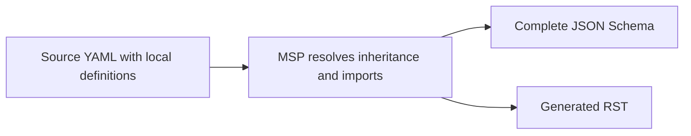

# Overview

This section explains the files and workflow used to develop a GKS product
schema. Source YAML files are hand-edited JSON Schema source documents written
in YAML. They define local model content and relationships; MSP generates the
complete inherited JSON Schema and RST artifacts. This guide is intended for
standards developers who edit models and their documentation, rather than MSP's
Python implementation.

* [Source YAML and Generated Output](source-and-output.md) explains the source
  files, generated artifacts, and expected product layout.
* [Product Build Template](product-build-template.md) shows the reusable
  `Makefile` and `prune.mk` used to generate and maintain artifacts.
* [Configuration](configuration.md) explains the product-level version, import,
  and namespace configuration.
* [References to Other Models](references.md) explains how to use `$refCurie`
  values instead of hard-coded versioned references.
* [Build and Review](build-and-review.md) explains how to generate and inspect
  artifacts.
* [Frequently Asked Questions](frequently-asked-questions.md) answers common
  questions about source files, versions, and dependencies.
